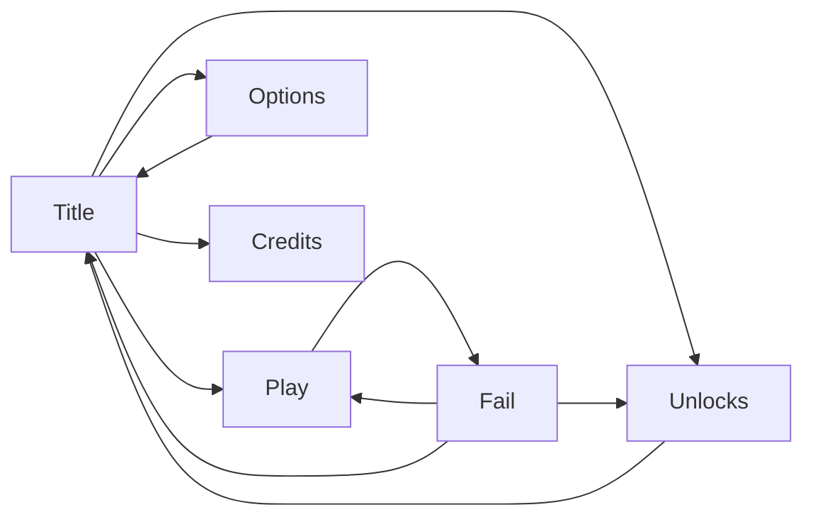

# rail-courier — design docs

Plain-language pack for building the game (Phaser 3 + Vite + TypeScript). Deploy as a simple web page (Netlify / arcade.gov-style). Solo. Ship once — this pack describes the finished game.

**Repo:** put these files under `docs/` on branch **`main` only**. No extra Cursor branches.

## What the game is

You ride a loaded monorail cart through a neon city. Camera sits behind the cart in a fixed screen slot (old-arcade path lock). World scrolls toward you. Nudge left/right to keep cargo from spilling. Pass stations for score; optional fling timing for bonus. Spill = fail. Between runs, upgrade the cart in a garage (Unlocks).

**Feel:** OutDrive / Outrun moodboard — magenta/cyan neon, striped sun, reflective rail, light trails. Original silhouettes only (no OutDrive IP/assets).

## Screen flow

## Screens (7)

| # | Screen | File |
|---|--------|------|
| 1 | Title | [screens/title.md](screens/title.md) |
| 2 | Play | [screens/play.md](screens/play.md) |
| 3 | HUD | [screens/hud.md](screens/hud.md) |
| 4 | Touch pads | [screens/touch-pads.md](screens/touch-pads.md) |
| 5 | Fail | [screens/fail.md](screens/fail.md) |
| 6 | Options | [screens/options.md](screens/options.md) |
| 7 | Unlocks (garage) | [screens/unlocks.md](screens/unlocks.md) |

Gameplay systems: [gameplay.md](gameplay.md) · Levels as plugins: [levels.md](levels.md)

## Hard nos (local builder AI)

- Do not port the old `dev` side-view lean/pit platformer
- No ECS on day one
- No gyro / tilt
- No online multiplayer
- No inventing OutDrive/IP art
- No inventing a final look before style lock (placeholders OK)
- No mid-run shop — upgrades only in Unlocks between runs
- No Cursor/extra branches — **main** only
- Document and build the finished game (no “we’ll patch later” scope)

## Roles

- **Riot** — design + these lo-fi wireframes
- **Sable** — art after exact asset lists / style lock
- **Mike** — builds and ships the code

## Lo-fi format

Markdown ASCII boxes (ugly on purpose). One Mermaid flow above. Sable’s polish mocks come later as a separate pack.
